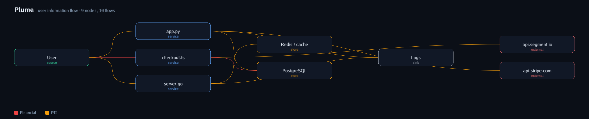

<p align="center">
  
</p>

<h1 align="center">Plume</h1>

<p align="center">
  One command. A readable map of how user information flows through any codebase or infrastructure: where personal data enters, where it is stored, where it is sent, and where it leaks.
</p>

<p align="center">
  <a href="https://github.com/judahpaul16/plume/actions/workflows/ci.yml"></a>
  <a href="https://github.com/judahpaul16/plume/releases"></a>
  
  <a href="https://goreportcard.com/report/github.com/judahpaul16/plume"></a>
  <a href="LICENSE"></a>
</p>

```sh
plume                                   # scan the current directory and open the graphic
plume ./service ./infra ./other-repo    # scan several paths as one graph
plume --out flow.png .                  # write a PNG (or .svg / .jpg) instead of HTML
```

Plume is a single static binary. No setup, no config, no annotations. It scans code
and infrastructure-as-code, builds a normalized flow graph, and opens a self-contained
interactive view in your browser (or writes a static image).

## What you get

A graph from User to your services to stores, logs, and third parties, where each edge
is tagged with the data categories it carries (email, name, card, SSN) and colored by
sensitivity. A flow that carries a sensitive category into a log sink or a third party
is exactly what a privacy review looks for.

The HTML view is interactive (served on a loopback port so it works everywhere):

- **Focus mode**: click a node to highlight its full upstream and downstream lineage.
- **Drag nodes** to rearrange; edges follow. **Export** the current layout as PNG, SVG, or JPG.
- **Filter** by sensitivity, **search** nodes, pan and zoom.
- A **Sankey** toggle for flow volume.

## What it detects

- **Sources**: the user, the origin of personal data.
- **Services**: your code files that handle it.
- **Stores**: database, ORM, cache, object-store, and queue writes.
- **Sinks**: logger and stdout writes.
- **External**: HTTP calls to non-local hosts, known SDKs (Stripe, Twilio, Segment,
  Sentry), and email or messaging sends.
- **Categories**: a built-in dictionary recognizes personal data by identifier name and
  assigns a sensitivity (PII, financial, credential, health, special).

Infrastructure-as-code (Terraform/HCL, compose, Kubernetes, Serverless) is a first-class
input: declared resources refine the generic stores, so a code-level "Database" becomes
"PostgreSQL (Amazon RDS)".

## How it works

`collectors -> normalized flow graph -> renderer`. Files are detected and parsed with an
embedded, pure-Go tree-sitter runtime that covers 200+ languages, in parallel across cores.
Extraction is zero-config static heuristics plus a personal-data dictionary: it surfaces
candidate flows and filters obvious placeholder data. Files that parse too slowly are
skipped so the scan stays fast (a hundred-file repo finishes in a few seconds). Extraction
is best-effort by nature; widen the dictionary and call patterns in `internal/scan` for
your stack.

## Install

Download a binary from [Releases](https://github.com/judahpaul16/plume/releases), or build
from source (Go 1.21+):

```sh
go install github.com/judahpaul16/plume@latest
# or
git clone https://github.com/judahpaul16/plume && cd plume && go build -o plume .
```

The release binaries are fully static (`CGO_ENABLED=0`), one per OS/arch.

## Usage

```
plume [flags] [path ...]      scan paths (default: current dir) and open the graphic
plume open <file>             reopen a saved report (.html, .svg, .png, .jpg)
plume version                 print the version
plume help                    print help

  --out FILE     output file; .html is interactive, .svg/.png/.jpg are static images
  --no-open      write the report but do not serve or open a browser
  --blackbox     collapse code files into one Application node and hide file paths
  --json         print the flow graph as JSON and exit
```

`--out` picks the format by extension: `.html` (default) renders the interactive viewer,
`.svg`/`.png`/`.jpg` render a static image directly from the CLI with no browser.

`--blackbox` is for sharing externally: it merges every code file into a single
"Application" node and drops file:line evidence, so the picture shows User to Application
to stores, sinks, and third parties without exposing internals.

## License

[MIT](LICENSE).
