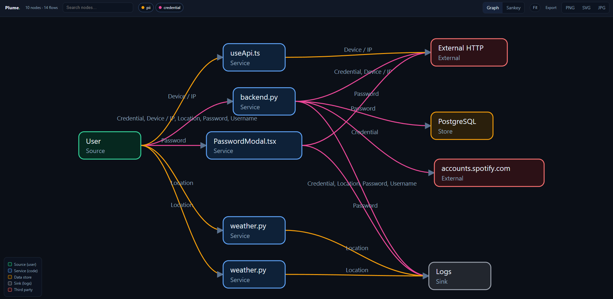
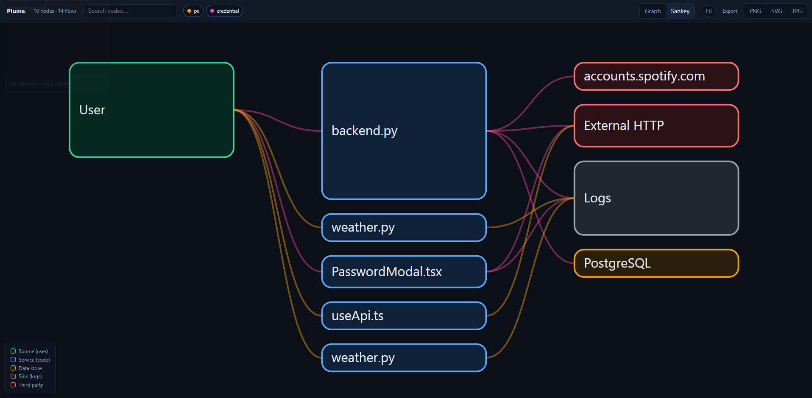

<div align="center">

# Plume

**One command. A readable map of how user information flows through any codebase or infrastructure: where personal data enters, where it is stored, where it is sent, and where it leaks.**


[](https://github.com/judahpaul16/plume/actions/workflows/ci.yml)
[](https://github.com/judahpaul16/plume/releases)
[](go.mod)
[](https://goreportcard.com/report/github.com/judahpaul16/plume)
[](LICENSE)

</div>

```sh
plume                                   # scan the current directory and open the graphic
plume ./service ./infra ./other-repo    # scan several paths as one graph
plume --out flow.png .                  # write a PNG (or .svg / .jpg) instead of HTML
plume open ./reports                    # browse a folder of saved reports
```

## What is Plume?

Plume is a single static binary that maps where personal data enters your system,
where it is stored, where it is sent, and where it leaks. Point it at a repo, several
repos, or an infrastructure folder; it scans the code and the infrastructure-as-code,
builds a normalized flow graph, and opens a self-contained interactive view in your
browser (or writes a static image).

No setup, no config, no annotations, no cloud account. Download the binary and run it.

## Features

- **Zero config.** One binary, no project setup, no annotations, no runtime dependencies.
- **Language-agnostic.** An embedded, pure-Go tree-sitter runtime parses 200+ languages.
- **Code and infrastructure in one graph.** Terraform/HCL, compose, Kubernetes, and
  Serverless resources refine the picture, so a code-level "Database" becomes
  "PostgreSQL (Amazon RDS)".
- **Sensitivity-aware.** A built-in dictionary classifies personal data (PII, financial,
  credential, health, special) and colors every flow by the most sensitive category it carries.
- **Interactive viewer.** Focus a node's lineage, drag to rearrange, filter by sensitivity,
  search, toggle a Sankey view, and export to PNG, SVG, or JPG.
- **Static image output.** Render straight to SVG, PNG, or JPG from the CLI, no browser.
- **Blackbox mode.** Collapse code internals into one node for sharing externally.
- **Fast.** Parallel parsing across cores; a hundred-file repo finishes in a few seconds.

## Screenshots

| Interactive graph | Flow volume (Sankey) |
| :---: | :---: |
|  |  |

Both views render straight to a static `.svg`, `.png`, or `.jpg` from the CLI with no
browser (`--out flow.png`, add `--sankey` for the volume view).

## What it detects

- **Sources**: the user, the origin of personal data.
- **Services**: your code files that handle it.
- **Stores**: database, ORM, cache, object-store, and queue writes.
- **Sinks**: logger and stdout writes.
- **External**: HTTP calls to non-local hosts, known SDKs (Stripe, Twilio, Segment,
  Sentry), and email or messaging sends.
- **Categories**: personal data recognized by identifier name, each with a sensitivity
  (PII, financial, credential, health, special).

A flow that carries a sensitive category into a log sink or a third party is exactly what
a privacy review looks for.

## How it works

`collectors -> normalized flow graph -> renderer`. Files are detected and parsed with an
embedded, pure-Go tree-sitter runtime, in parallel across cores. Extraction is zero-config
static heuristics plus a personal-data dictionary: it surfaces candidate flows and filters
obvious placeholder data. Infrastructure-as-code is correlated to the code that targets it
by env var, resource name, and host. The graph is inlined into a self-contained HTML viewer,
or rendered to a static image.

Extraction is best-effort by nature; widen the dictionary and call patterns in
`internal/scan` for your stack.

## Who it's for

- **Privacy and security reviews**: see at a glance which sensitive categories reach third
  parties or logs.
- **DPIA and records of processing**: a starting inventory of what personal data the system
  handles and where it goes.
- **Audits and onboarding**: a readable map of an unfamiliar codebase's data flows.

## Install

Download a binary from [Releases](https://github.com/judahpaul16/plume/releases), or install
from source with Go 1.22+ (`go install` is the `cargo install` equivalent):

```sh
go install github.com/judahpaul16/plume@latest
# or build a local checkout
git clone https://github.com/judahpaul16/plume && cd plume && go build -o plume .
```

`go install` drops the binary in `$(go env GOPATH)/bin` (usually `~/go/bin`). Add that to
your `PATH` so the `plume` command is found:

```sh
export PATH="$PATH:$(go env GOPATH)/bin"   # add to ~/.bashrc or ~/.zshrc to persist
```

The release binaries are fully static (`CGO_ENABLED=0`), one per OS/arch.

## Usage

```
plume [flags] [path ...]      scan paths (default: current dir) and open the graphic
plume open <file|dir>         reopen a saved report, or pick from a folder of reports
plume version                 print the version
plume help                    print help

  --out FILE     output file; .html is interactive, .svg/.png/.jpg are static images
  --no-open      write the report but do not serve or open a browser
  --blackbox     collapse code files into one Application node and hide file paths
  --json         print the flow graph as JSON and exit
```

`--out` picks the format by extension: `.html` (default) renders the interactive viewer;
`.svg`, `.png`, and `.jpg` render a static image directly from the CLI. `plume open`
reopens any of those, and given a directory it serves a picker gallery of every report in
the folder.

`--blackbox` merges every code file into a single "Application" node and drops file:line
evidence, so the picture shows User to Application to stores, sinks, and third parties
without exposing internals.

## Accuracy

Plume is a static, zero-config heuristic scanner: it surfaces candidate flows from
identifier names and call shapes and filters obvious placeholder data. It is a fast first
map, not a guarantee of completeness. Tune the dictionary and patterns in `internal/scan`
to fit your stack.

## Contributing

Issues and pull requests are welcome. The scanner's dictionary and call patterns live in
`internal/scan`, the graph model in `internal/graph`, the renderers in `internal/report`,
and the viewer in `web`.

## License

[MIT](LICENSE).
